# MachineFi Runtime

[](https://github.com/Machine-Fi/runtime/actions/workflows/ci.yml)
[](https://www.npmjs.com/package/@machinefi/runtime)
[](LICENSE)


MachineFi Runtime is the public TypeScript SDK and CLI for wallet-linked autonomous machines: robot arms, drones, sensors, rovers, warehouse bots, and DePIN/edge hardware. It gives developers inspectable building blocks for machine identity, capabilities, job lifecycle, telemetry snapshots, policy decisions, unsigned settlement intents, work proofs, and receipt verification.

Solana is the only rail implemented in this checkout. It sits underneath the machine runtime as settlement, proof, and audit infrastructure. The broader MachineFi Robotics platform handles production orchestration, hardware integrations, private provider routing, treasury controls, and closed-core policy services outside this repository.

## GitHub milestones

This checkout declares package version `v0.9.4`. Its source tree contains the Solana adapter and generic machine-runtime interfaces; it does not contain a Robinhood/EVM adapter. Do not infer support for a rail from stale external examples or historical tests.

## What this repo exposes

- Machine identity and capability models for robots, drones, sensors, and edge nodes.
- Job/task lifecycle helpers from creation through proof submission and settlement linkage.
- Telemetry/status snapshot validation for battery, health, signal, progress, and optional location/pose data.
- Public-safe policy decisions for machine work acceptance and settlement limits.
- Unsigned caller-wallet settlement intents; no private keys, custody, autonomous signing, or broadcast.
- Source-aware Solana receipt evidence, including status, transaction/log/balance evidence, fixture/envelope labeling, and expectation mismatch reasons.
- Fixture-mode CLI and examples for robot job lifecycle, drone inspection settlement, and sensor data payment.
- An opt-in production Console application with wallet authentication, PostgreSQL ownership/persistence, machine credentials, persisted runtime sessions/work orders, live telemetry SSE plus durable reconciliation, an application-level request/quote/grant/receipt marketplace lifecycle, and caller-wallet-signed Solana transaction submission.

## What builders can inspect

| Surface | Files | What to look for |
| --- | --- | --- |
| Machine identity and sessions | [`src/machines`](src/machines), [`src/session.ts`](src/session.ts), [`docs/runtime-sessions.md`](docs/runtime-sessions.md) | roles, capabilities, pairing records, runtime session shape |
| Work lifecycle and telemetry | [`src/jobs`](src/jobs), [`src/telemetry`](src/telemetry), [`docs/machine-runtime.md`](docs/machine-runtime.md) | work stages, telemetry normalization, policy gates |
| Settlement intents | [`src/settlement`](src/settlement), [`docs/settlement-intents.md`](docs/settlement-intents.md) | unsigned caller-wallet intent records and decimal/base-unit validation |
| Receipt verification | [`src/adapters`](src/adapters), [`docs/receipt-verification.md`](docs/receipt-verification.md) | Solana source-aware receipt evidence and mismatch reasons |
| CLI and fixtures | [`src/cli`](src/cli), [`fixtures`](fixtures), [`tests`](tests) | deterministic runtime checks used by CI and examples |

## Install

```bash
npm install @machinefi/runtime
npx machinefi status --chain solana --fixture
```

## Run locally

The repo ships a local runtime console that exposes the same operations as the CLI over HTTP, so you can exercise sessions, intents, and receipt evidence from a browser or curl.

```bash
npm install
npm run dev          # tsx watch, reloads on change
# or
npm run serve        # build once, then run dist/server/index.js
```

Open <http://localhost:8787>. Port and bind address are configurable via `--port` / `--host`, or `MACHINEFI_PORT` / `PORT` / `MACHINEFI_HOST`.

| Route | Purpose |
| --- | --- |
| `GET /` | Runtime console UI, prefilled with fixture values |
| `GET /api` | Route index |
| `GET /api/health` | Server and runtime mode |
| `GET /api/inspect` | Chain constants |
| `GET /api/fixtures` | Fixture receipts available for verification |
| `GET\|POST /api/status` | Chain reachability, mirrors `machinefi status` |
| `GET\|POST /api/pair` | Machine session, mirrors `machinefi pair` |
| `GET\|POST /api/intent/build` | Unsigned settlement intent, mirrors `machinefi intent build` |
| `GET\|POST /api/verify` | Receipt evidence, mirrors `machinefi verify` |
| `GET /api/resources` | Audited resource vocabulary and marketplace capability state |
| `POST /api/resources/discover` | Validate a resource request and query the configured provider source |
| `POST /api/resources/request` | Validate then fail closed when no submission backend is configured |

```bash
curl "http://localhost:8787/api/status?chain=solana&fixture=true"
curl -X POST http://localhost:8787/api/verify -H 'content-type: application/json' \
  -d '{"chain":"solana","fixture":true,"signature":"5HueCGU8rMjxEXxiPuD5BDuRaRj1hUXQG48GhYnjmQumooWcT3Yr4v7e1i4bnzK7t1Q7Fxx4E2VPu7Y9xV1r5fq"}'
```

The server binds loopback and defaults every request to fixture mode. This fixture/local mode has no authentication layer, so live-read mode is opt-in and uses one endpoint chosen by the server operator:

```bash
MACHINEFI_SOLANA_RPC_URL="https://your-solana-rpc.example" npm run serve -- --allow-live
# equivalent: npm run serve -- --allow-live --rpc-url "https://your-solana-rpc.example"
curl -X POST http://localhost:8787/api/status -H 'content-type: application/json' \
  -d '{"chain":"solana","fixture":false}'
```

HTTP requests cannot override the configured RPC URL; any `rpcUrl` request field is rejected. Provider responses, redirects, and concurrent outbound calls are bounded. Requests carrying an unconfigured `Host` or a cross-site `Origin` are rejected, and wildcard bind hosts are refused unless an authenticated production deployment explicitly enables a managed-platform bind. Do not expose fixture mode beyond your machine.

For an authenticated persistent deployment, use the separate `MACHINEFI_DATA_MODE=production` configuration. It requires PostgreSQL, a TLS public origin, an operator-controlled RPC, and a verified Solana cluster/genesis expectation; it never falls back to fixtures. See [`docs/production-console.md`](docs/production-console.md) for the exact authentication, persistence, marketplace, non-custodial signing, telemetry, operational limits, and remaining mainnet work.

## Machine-first examples

```bash
npx machinefi pair --chain solana --fixture --machine-id drone-9 --wallet 11111111111111111111111111111111 --operator flight-ops
npx machinefi intent build --chain solana --source 11111111111111111111111111111111 --recipient Sysvar1111111111111111111111111111111111111 --amount 0.5 --machine-id drone-9 --session-id session-1 --fixture
npx machinefi verify --chain solana --signature 5HueCGU8rMjxEXxiPuD5BDuRaRj1hUXQG48GhYnjmQumooWcT3Yr4v7e1i4bnzK7t1Q7Fxx4E2VPu7Y9xV1r5fq --fixture --from 11111111111111111111111111111111 --to Sysvar1111111111111111111111111111111111111 --amount 0.5 --machine-id drone-9 --session-id mfi_solana_fixture_session
```

Executable examples are included under `src/examples/`:

- `robot-job-lifecycle.ts` — robot arm session, capability policy, unsigned intent, and work proof linkage.
- `drone-inspection-settlement.ts` — drone telemetry, Solana settlement intent, and receipt expectations.
- `sensor-data-payment.ts` — edge sensor data job, policy decision, and proof metadata.

## Runtime flow

```mermaid
flowchart LR
  Developer[Developer / operator]
  Machine[Machine identity]
  Session[Runtime session]
  Work[Work order]
  Telemetry[Telemetry snapshot]
  Policy[Policy decision]
  Intent[Unsigned settlement intent]
  Wallet[Caller wallet / provider flow]
  Receipt[Receipt evidence]
  Proof[Work proof record]

  Developer --> Machine
  Machine --> Session
  Session --> Work
  Work --> Telemetry
  Telemetry --> Policy
  Policy --> Intent
  Intent --> Wallet
  Wallet --> Receipt
  Receipt --> Proof
```



1. Register a machine identity with role, capabilities, wallet/account, and operator.
2. Pair a rail-specific runtime session.
3. Create a job with required capabilities and settlement terms.
4. Normalize telemetry/status snapshots.
5. Evaluate policy before accepting work.
6. Build an unsigned caller-wallet settlement intent.
7. Link telemetry/result references to a work evidence bundle.
8. Verify Solana receipt evidence as settlement/proof records, with native chain fields separated from MachineFi envelope or fixture metadata.

## Live mode

CLI/SDK live reads may use a caller-supplied Solana provider endpoint such as `MACHINEFI_SOLANA_RPC_URL` or `--rpc-url`. The HTTP server accepts its endpoint only from operator startup configuration and never from an HTTP request. Fixture mode is deterministic for CI and examples.

## Public boundary

This repository remains a public runtime interface layer. The opt-in production Console supplies authenticated persistence and application workflows, but it is not a hosted service or turnkey mainnet stack. The repository does not include production robot-control drivers, external provider provisioning, private policy engines, treasury custody, private keys, seed phrases, distributed operations infrastructure, or a security-reviewed production deployment.
