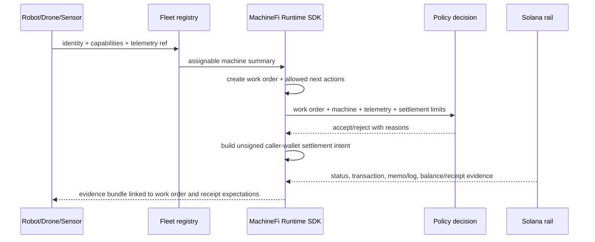

# Architecture

MachineFi Runtime is the public interface layer for autonomous machine work. Solana is the settlement/proof rail implemented below that runtime, not the whole product.

## Public layers

- Machine identity, capabilities, and fleet registry state.
- Work-order lifecycle and telemetry evidence references.
- Policy decisions for whether work can be accepted.
- Unsigned settlement intents owned by caller wallets.
- Source-aware receipt verification and work evidence bundles.
- CLI and deterministic fixture mode for examples and CI.

## Closed-core boundary

The repository does not include production robot-control drivers, autonomous signing, private keys, treasury policy, private provider routing, or a hosted/turnkey production deployment.

## Opt-in production Console application

The authenticated production Console is an application-layer carve-out from the SDK's read-only/unsigned boundary. When `MACHINEFI_DATA_MODE=production` is explicitly enabled, it can construct a canonical version-0 Solana settlement transaction from an accepted, persisted resource quote. The authenticated caller reviews and signs with a compatible Wallet Standard account; the server then simulates, submits, and reconciles the caller-signed bytes against its verified Solana RPC. The application does not hold private keys, sign autonomously, or move treasury funds. Its operational and security requirements are documented in [Production Console and API](./production-console.md).

## Finality and settlement limit helpers

Receipt adapters share finality helpers for provider-derived confirmations and Solana status normalization. Settlement policy helpers convert validated decimal strings to base units before comparing machine-job limits, so examples and policy checks use the same caller-wallet boundary as the runtime adapters.
