# MachineFi Runtime

[](https://github.com/machina3001/MachinaSol/actions/workflows/ci.yml)
[](https://www.npmjs.com/package/@machinefi/runtime)
[](LICENSE)


Public SDK and CLI for wallet-linked machine sessions across autonomous robots, drones, sensors, and edge hardware. The package models machine identity, capabilities, jobs, telemetry snapshots, policy decisions, unsigned settlement intents, work proofs, and Solana source-aware receipt evidence verification.

Rails are settlement/proof infrastructure underneath the machine runtime. Production orchestration, robot-control integrations, provider routing, treasury controls, and private policy services are outside this package.

## GitHub milestones

This checkout declares package version `v0.9.4` and implements the Solana rail. It does not contain a Robinhood/EVM adapter.

## Install

```bash
npm install @machinefi/runtime
npx machinefi status --chain solana --fixture
npx machinefi pair --chain solana --fixture --machine-id drone-9 --wallet 11111111111111111111111111111111 --operator flight-ops
```

## Runtime flow

```mermaid
flowchart LR
  Developer[Developer / operator]
  Machine[Machine identity]
  Session[Runtime session]
  Work[Work order]
  Telemetry[Telemetry snapshot]
  Policy[Policy decision]
  Intent[Unsigned settlement intent]
  Wallet[Caller wallet / provider flow]
  Receipt[Receipt evidence]
  Proof[Work proof record]

  Developer --> Machine
  Machine --> Session
  Session --> Work
  Work --> Telemetry
  Telemetry --> Policy
  Policy --> Intent
  Intent --> Wallet
  Wallet --> Receipt
  Receipt --> Proof
```



Fixture mode is deterministic for CI. CLI/SDK live reads use caller-supplied provider endpoints and remain read-only; the local HTTP server uses only its operator-configured endpoint and rejects endpoint overrides in requests. The package labels native chain evidence separately from fixture/envelope metadata and does not sign, broadcast, custody funds, or control hardware.
